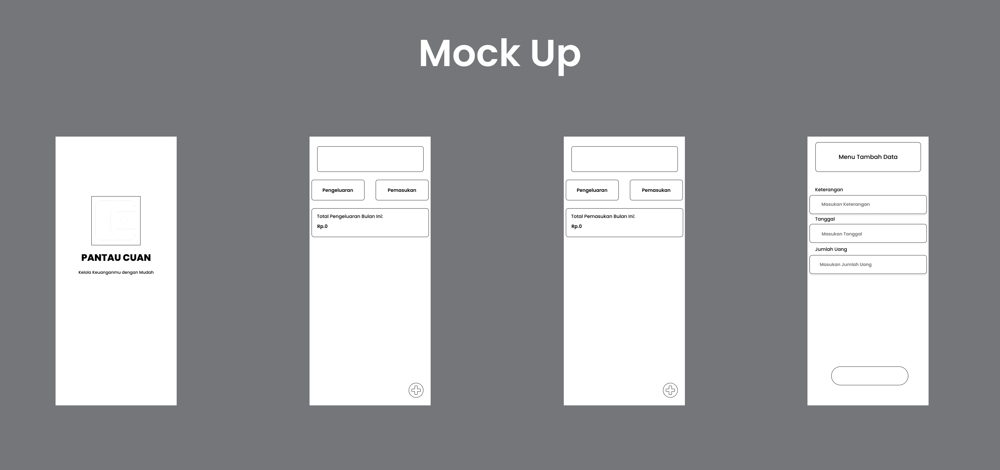

## Aplikasi PantauCuan 
| UTS  |  Pemrograman Mobile 1  
|-------|---------
| NIM   | 312310576
| Nama  | Taufik Hidayat
| Kelas | TI.23.A6

### Story Board

- **1.** Tampilan pembuka aplikasi dengan logo "Pantau Cuan" dan slogan "Kelola keuanganmu dengan mudah". Latar belakang gradien biru gelap.

- **2.** Menampilkan opsi "Hitung Keuangan" dan "Pengelolaan". Bagian "Hitung Keuangan" menampilkan rincian total pengeluaran. Ada tombol "+" untuk menambahkan transaksi baru. Fitur "Pengelolaan" mungkin menyediakan opsi untuk mengatur anggaran, mencatat pemasukan, dll.

- **3.** Pengguna dapat mengisi detail transaksi baru, seperti tanggal, kategori, jumlah, dll.
Terdapat tombol "Simpan" untuk menyimpan data baru.

### Mock Up

### Font & Warna UI

### UI

### Eksekusi Android Studio

- Splash Screen

- Halaman Utama

- Halaman Tambah Data

### Penjelasan Fitur Aplikasi Pantau Cuan

Aplikasi Pantau Cuan dirancang untuk membantu pengguna dalam mengelola pemasukan dan pengeluaran mereka secara praktis. Berikut adalah deskripsi dari setiap layar yang tersedia dalam aplikasi:

**1. Splash Screen**

Layar pembuka yang menampilkan logo dan tagline Pantau Cuan: "Kelola Keuanganmu dengan Mudah".
Menciptakan kesan awal yang profesional dan ramah pengguna sebelum masuk ke fitur-fitur utama aplikasi.

**2. Layar Utama - Pengeluaran dan Pemasukan**

Layar utama aplikasi yang menampilkan total pengeluaran dan pemasukan bulan ini, memudahkan pengguna dalam melihat ringkasan keuangan.

- Pengeluaran: Menampilkan total pengeluaran yang telah dicatat dalam bulan berjalan.

- Pemasukan: Menampilkan total pemasukan yang telah dicatat dalam bulan berjalan. Jika belum ada data, akan muncul pesan motivasi untuk mencatat pemasukan.

- Tombol Tambah Data (+): Tombol ini ada di pojok kanan bawah untuk menambah transaksi baru, baik pemasukan maupun pengeluaran.

**3. Layar Tambah Data**

Layar ini memungkinkan pengguna untuk mencatat transaksi baru.

- Keterangan: Pengguna memasukkan deskripsi transaksi.

- Tanggal: Pengguna memilih atau memasukkan tanggal transaksi.

- Jumlah Uang: Pengguna memasukkan jumlah uang dalam transaksi.

- Opsi Pemilihan: Memilih untuk pengeluaran atau pemasukan transaksi.

- Tombol Simpan: Setelah data terisi otomatis akan kembali kelayar utama, pengguna dapat menekan tombol ini untuk menyimpan transaksi ke database aplikasi.

 ### Teknologi yang digunakan

- **Frontend**: XML
- **Backend**: Java
- **Database**: -
- **Tools**: Git, GitHub, Android Studio

## Copyright © 2024. All rights reserved.

